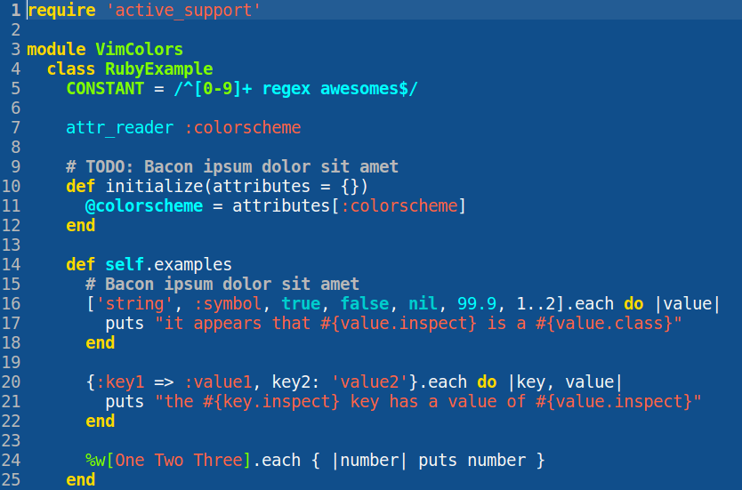

# Blue Mood theme for gedit/pluma/xed

This is a port of [emacs's Blue Mood theme](https://emacsthemes.com/themes/blue-mood-theme.html) for gedit, pluma and xed.

## Motivation

I like the aforementioned theme very much, and started wishing I could get something similar in xed, my editor of choice for the simple tasks. One day I stumbled upon the [Dracula theme for gedit](https://github.com/dracula/gedit), and realised I could make such a theme myself. The result is the present repository.

## Notes

Keep in mind that this port doesn't correspond 100% to the original emacs theme, due to the limitations of gtksourceview in comparison to emacs's theming system.

## Installation

Go to the Fonts & Colors tab of the preferences, press the Add button under the Color Scheme list and navigate to the theme file. Alternatively, copy the bluemood.xml file to the color schemes directory: `~/.local/share/gedit/styles` (if on gedit), `~/.local/share/gtksourceview-3.0/styles` (if on xed), or `~/.config/pluma/styles` (if on pluma).

## Activation

1. Open the Preferences in Gedit/pluma/xed
2. Switch to the "Font & Colors" tab
3. Select "Blue Mood" from the "Color Scheme" list

### Tested on…

xed 1.6.3 on Linux Mint 18.3 (with XML, html, css, scheme (scm), python 2 and 3, markdown, orgmode, plain text, javascript, json, Go, .desktop and .bib files), and pluma 1.12.2 on Ubuntu Mate 16.04.3.

### Credits

The initial structure for this file was largely based upon the aforementioned Dracula theme for gedit, and I consulted [Gtksourceview's style scheme definition reference](https://developer.gnome.org/gtksourceview/stable/style-reference.html) and [Gtksourceview's language specs](https://git.gnome.org/browse/gtksourceview/tree/data/language-specs).
